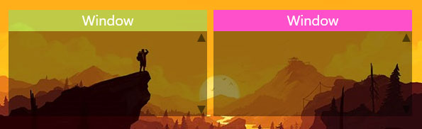
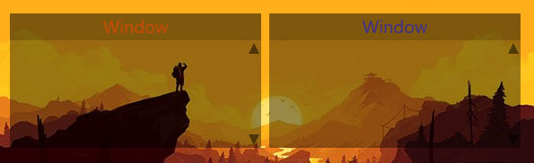
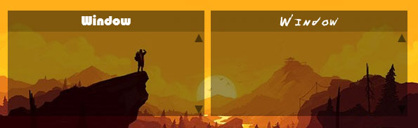
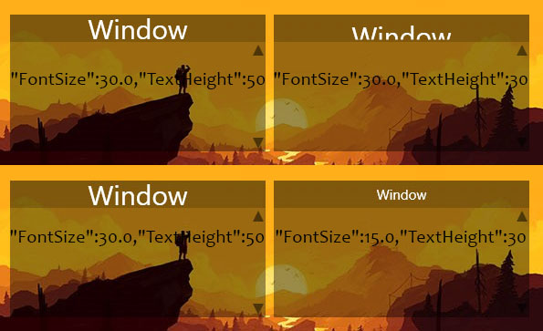
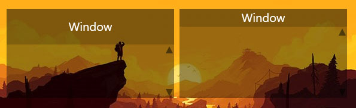
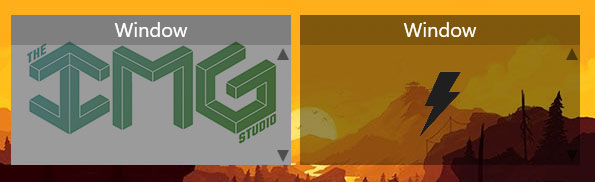
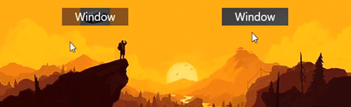
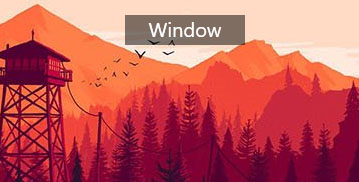
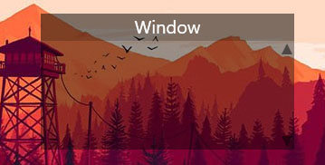

QsFlai
====
**Quick square for launcher app icons.**

Описание:
**Like Fences, but OpenSource.**<br>
Приложение помогает освободить рабочий стол от файлов. На данный момент нельзя изменять внешний вид приложения через само приложение. Кастомизация приложения происходит, посредством изменения файла конфигурации. Данный файл генерируется в папку с приложением под названием "QsFlai.settings".


Демонстрация приложения
----


Настройки приложения GUI
----

Чтобы открыть файл/папку/приложение достаточно один раз кликнуть на него.

#### 0. Переход в режим редактирования

Для того, чтобы перейти в режим редактирования нужно нажать правой кнопкой мыши на название окна и выбрать в выпадающем меню пункт "Edit mode".

#### 1. Изменение названия экземпляра

Нужно перейти в режим редактирования. Двойной клик по названию окна. После этого действия станет доступен TextBox, в котором можно изменить название экземпляра.

#### 2. Перемещение окна

Для перемещения окна в произвольную позицию нужно перейти в режим редактирования окна и потянуть за верхнюю половину окна, в месте, где отсутствует текст.

#### 3. Изменение размеров окна

Нужно перейти в режим редактирования, после этого достаточно потянуть за любой угол окна.

#### 4. Добаление нового окна

Клик правой кнопкой мыши по названию окна, в открывшемся меню нужно выбрать пункт "Add window", после данного действия появится новое окно в левом вержнем углу экрана.

### 5. Закрыть окно

Нужно кликнуть правой кнопкой мыши по названию окна и в выпадающем списке выбрать пункт "Close window". После этого появится диалоговое окно с возможностью выбора:<br> 
    1. Полного закрытия окна(Да) - после перезапуска приложения окно не появится.<br>
    2. Частичного закрытия окна(Нет) - после перезапуска приложения окно снова появится.<br>
    3. Отмену действия(Отмена) - диалоговое окно закроется.<br>

#### 6. Перезагрузка приложения

Нужно кликнуть правой кнопкой мыши по названию окна и в выпадающем списке выбрать пункт "Reolad app". После данного действия приложения закроет все окна, прочитает конфигурационный файл("QsFlai.settings") и в соответствии с этим файлом создаст окна.

#### 7. Закрыть приложение

Нужно кликнуть правой кнопкой мыши по названию окна и в выпадающем списке выбрать пункт "Shutdown app". После выбора данного пункта приложение завершит работу.

#### 8. Добавление файлов/папок/программ в приложение

Нужно перейти в режим редактирования и перетащить нужные файлы/папоки/программы в окно программы.

#### 9. Сохранение настроек 

После изменения размеров, названия, количества окон и т.д. Нужно сохранить настройки. Чтобы это сделать нужно кликнуть правой кнопкой мыши по названию окна и выбрать пункт "Save".


Настройки приложения через конфирурационный файл "QsFlai.settings"
----

В данном файле настройки хранятся в формате JSON.

    [
        { Настройуи 1-го окна },
        { Настройуи 2-го окна },
        { Настройуи 3-го окна }
    ]

Настройки x-го окна разделены на несколько груп:

    [
        {
            "id":"", // Внутреннй идентификатор окна. У кажндго окна должен быть уникальный идентификатор.
            "border":{}, // Настройки отвечающие за внешний вид верхней части окна
            "BackgroundImage":"", // Изображение на заднем плане. Может быть null
            "isImgStaticSize":"", // Будет ли изображение менять свои размеры при анимации разворачивания и сворачивания окна.
            "Position":"", // Позиция окна на экране
            "Scale":{}, // Размеры окна
            "Animation":{}, // Данный блок отвечает за настройку анимации окна
            "filesSettings":{}, // Настройки файлов(Например ширина и высота).
            "Files":[ {},{} ], // Список файлов
            "editMode":{} // Настройки окна при нахождении его в режиме редактирования
        }
    ]

Рассмотрим каждый параметор отдельно.

1. ```"id":"0"``` - любое целое число от -100 000 до 100 000
2. ```"border":{"Name":"Window","BorderColor":"#80000000","TextColor":"#FFFFFFFF","FontFamily":"Segoe UI","FontSize":20.0,"TextHeight":40,"BorderHeight":30}``` 

    2.1 ```"Name":"Window"``` - Название окна 

    2.2 ```"BorderColor":"#80000000"``` - Цвет верхней части окна 

     

    2.3 ```"TextColor":"#FFFFFFFF"``` - Цвет названия окна

    

    2.4 ```"FontFamily":"Segoe UI"``` - Шрифт названия окна

    

    2.5 ```"FontSize":20.0``` и ```"TextHeight":40``` редактируются вместе т.к. 'Label' не умеет работать с размерами шрифтов.

    2.5.1 ```"FontSize":20.0``` - Размер шрифта

    2.5.2 ```"TextHeight":40``` - Высота 'Label'

    

    2.6 ```"BorderHeight":30``` - Высота верхней части окна (Вместе с данным параметром нужно менять значение ```Scale":{"Initial":"...,30"``` в блоке ```"Scale":{}```. Эти два значения в большинстве случаев должны совпадать.)

    

3. ```"BackgroundImage":""``` - Изображение на заднем плане окна. Изображение должно находиться в одной папке с приложением. (Рекомендуется менять с параметрами: ```"BorderColor":"#80000000"```, ```"editMode":{"originalColor":"#64000000"```)

    

4. ```"isImgStaticSize":"true"``` - Будет ли изображение менять свои размеры при анимации. Может принимать значения ```true```/```false```.

    

5. ```"Position":"100,512"``` - Позиция окна на экране

6. ```"Scale":{"Initial":"120,30","Final":"280,150"}``` - Размеры окна.

    6.1 ```"Initial":"120,30"``` - Начальный размер.

    

    6.2 ```"Final":"280,150"``` - Конечный размер

    

7. ```"Animation":{"Speed":1000}``` - Настройка анимации окна

    7.1 ```"Speed":1000``` - Скорость анимации окна

    250/1000

    


